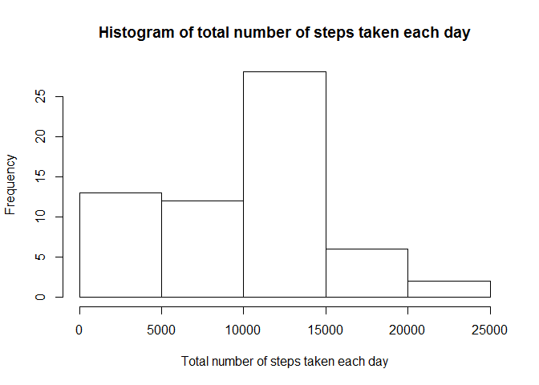

## Loading and preprocessing the data
Unzip the file with the dataset and load data into `data`:

```r
unzip( "activity.zip" )
data <- read.csv( "activity.csv" )
```

where the structure of `data` is:

```r
str( data )
```

```
## 'data.frame':	17568 obs. of  3 variables:
##  $ steps   : int  NA NA NA NA NA NA NA NA NA NA ...
##  $ date    : Factor w/ 61 levels "2012-10-01","2012-10-02",..: 1 1 1 1 1 1 1 1 1 1 ...
##  $ interval: int  0 5 10 15 20 25 30 35 40 45 ...
```

Recognize dates in the `data$date` column instead of levels:

```r
data$date <- as.Date( data$date )
```
which leads to the following structure of `data` object:

```r
str( data )
```

```
## 'data.frame':	17568 obs. of  3 variables:
##  $ steps   : int  NA NA NA NA NA NA NA NA NA NA ...
##  $ date    : Date, format: "2012-10-01" "2012-10-01" ...
##  $ interval: int  0 5 10 15 20 25 30 35 40 45 ...
```


## What is mean total number of steps taken per day?
Create a new dataframe `numberOfStepsPerDayTotal` with total number of steps taken per day:

```r
numberOfStepsPerDayTotal <- aggregate( data$steps, by = list( date = data$date ), FUN = sum, na.rm = TRUE )
```

where the structure of `numberOfSteps` is:

```r
str( numberOfStepsPerDayTotal )
```

```
## 'data.frame':	61 obs. of  2 variables:
##  $ date: Date, format: "2012-10-01" "2012-10-02" ...
##  $ x   : int  0 126 11352 12116 13294 15420 11015 0 12811 9900 ...
```

Make a histogram of a total number of steps taken each day:

```r
hist( numberOfStepsPerDayTotal$x, main = "Histogram of total number of steps taken each day", xlab = "Total number of steps taken each day" )
```

<!-- -->

Calculate the mean of the total number of steps taken per day:

```r
mean( numberOfStepsPerDayTotal$x )
```

```
## [1] 9354.23
```

and the median of the total number of steps taken per day:

```r
median( numberOfStepsPerDayTotal$x )
```

```
## [1] 10395
```


## What is the average daily activity pattern?
Create a new dataframe `numberOfStepsPerIntervalAvg` with average number of steps taken per interval, averaged across all days:

```r
numberOfStepsPerIntervalAvg <- aggregate( data$steps, by = list( interval = data$interval ), FUN = mean, na.rm = TRUE )
```

where the structure of `numberOfStepsPerIntervalAvg` is:

```r
str( numberOfStepsPerIntervalAvg )
```

```
## 'data.frame':	288 obs. of  2 variables:
##  $ interval: int  0 5 10 15 20 25 30 35 40 45 ...
##  $ x       : num  1.717 0.3396 0.1321 0.1509 0.0755 ...
```

Make a time series plot of the average number of steps taken per interval, averaged across all days:

```r
plot( numberOfStepsPerIntervalAvg$interval, numberOfStepsPerIntervalAvg$x, type = "l", main = "Average number of steps taken per interval,\n averaged across all days", xlab = "Interval index", ylab = "Average number of steps taken per interval" )
```

<!-- -->

Determine which 5-minute interval, on average across all the days in the dataset, contains the maximum number of steps:

```r
numberOfStepsPerIntervalAvg$interval[numberOfStepsPerIntervalAvg$x == max( numberOfStepsPerIntervalAvg$x )]
```

```
## [1] 835
```


## Imputing missing values
Calculate the total number of missing values in the original dataset (i.e. the total number of rows with NA's):

```r
sum( is.na( data$steps ) )
```

```
## [1] 2304
```

Determine the indices `indx` of the missing data:

```r
indx <- which( is.na( data$steps ) )
```

Fill in the missing values in the dataset by the mean for that 5-minute interval. Create a new dataset that is equal to the original dataset but with the missing data filled in:

```r
f <- function( i ){
  data[i,1] <- as.numeric( numberOfStepsPerIntervalAvg[numberOfStepsPerIntervalAvg[,1] == data[i,3],2] )
}
data$steps[indx] <- sapply( indx, f )
```

which leads to the following structure of `data` object:

```r
str( data )
```

```
## 'data.frame':	17568 obs. of  3 variables:
##  $ steps   : num  1.717 0.3396 0.1321 0.1509 0.0755 ...
##  $ date    : Date, format: "2012-10-01" "2012-10-01" ...
##  $ interval: int  0 5 10 15 20 25 30 35 40 45 ...
```


Create a new dataframe `numberOfStepsPerDayTotal` with total number of steps taken per day:

```r
numberOfStepsPerDayTotal <- aggregate( data$steps, by = list( date = data$date ), FUN = sum )
```

where the structure of `numberOfSteps` is:

```r
str( numberOfStepsPerDayTotal )
```

```
## 'data.frame':	61 obs. of  2 variables:
##  $ date: Date, format: "2012-10-01" "2012-10-02" ...
##  $ x   : num  10766 126 11352 12116 13294 ...
```

Make a histogram of a total number of steps taken each day:

```r
hist( numberOfStepsPerDayTotal$x, main = "Histogram of total number of steps taken each day", xlab = "Total number of steps taken each day" )
```

<!-- -->

Calculate the mean of the total number of steps taken per day:

```r
mean( numberOfStepsPerDayTotal$x )
```

```
## [1] 10766.19
```

and the median of the total number of steps taken per day:

```r
median( numberOfStepsPerDayTotal$x )
```

```
## [1] 10766.19
```
These values differ from the estimates from the first part of the assignment. The estimates of the total daily number of steps increase as the missing data is imput.
 

## Are there differences in activity patterns between weekdays and weekends?
Create a new factor variable in the dataset with two levels - "weekday" and "weekend" indicating whether a given date is a weekday or weekend day:

```r
library(chron)
data$day <- is.weekend( data$date )
data$day[ data$day == TRUE ] <- "weekend"
data$day[ data$day == FALSE ] <- "weekday"
data$day <- as.factor( data$day )
str(data)
```

```
## 'data.frame':	17568 obs. of  4 variables:
##  $ steps   : num  1.717 0.3396 0.1321 0.1509 0.0755 ...
##  $ date    : Date, format: "2012-10-01" "2012-10-01" ...
##  $ interval: int  0 5 10 15 20 25 30 35 40 45 ...
##  $ day     : Factor w/ 2 levels "weekday","weekend": 1 1 1 1 1 1 1 1 1 1 ...
```

Make a panel plot containing a time series plot of the 5-minute interval and the average number of steps taken, averaged across all weekday days or weekend days:

```r
library( ggplot2 )
viewGraph <- ggplot( data, aes( interval, steps ) ) + facet_grid( day ~. ) + stat_summary( fun.y = mean, geom = "line")
viewGraph <- viewGraph + theme_bw() + labs( x = "Interval index", y = "Average number of steps taken per interval", title = "Average number of steps taken per interval on weekdays and weekend days" )
print( viewGraph )
```

<!-- -->
